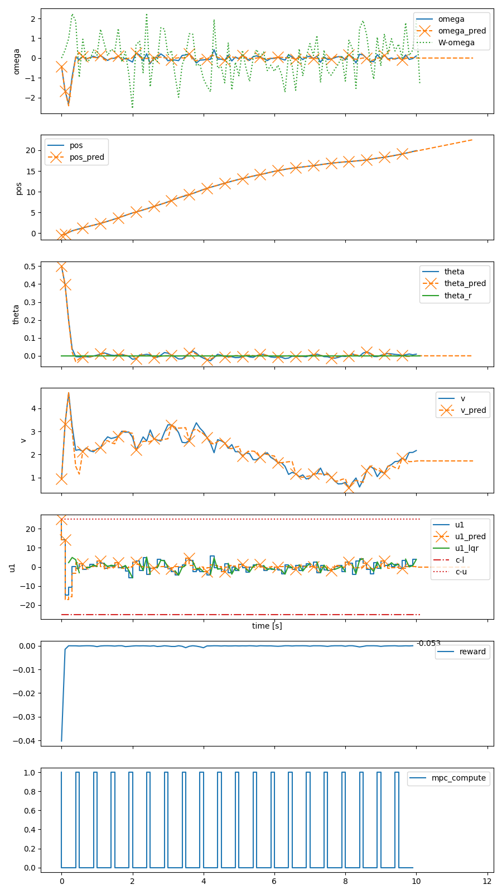

# gym-letMPC - OpenAI Gym Environment for Event-Triggered MPC

This repository implements the dual mode MPC and LQR control system architecture as described in the [accompanying paper](https://arxiv.org/abs/2011.13365), and also implements an 
openAI gym interface so that it can be integrated with reinforcement learning libraries. The MPC and simulator is
implemented based on the [do-mpc](https://www.do-mpc.com/en/latest/) python library and the [CasADi](https://web.casadi.org/)
optimization software.

## Disclaimer
This environment uses the python function eval to run code provided by the json configuration file, and as such could run
arbitrary code on your system, the consequences of which the author takes no responsibility for. Please ensure that any
json configuration files used does not contain any malicious code.

## Installation
```shell
git clone https://github.com/eivindeb/gym-letMPC
cd gym-letMPC
pip install -e .
```

## Example
An example configuration file defining a cart pendulum system is provided, where the MPCs cost functions defines the objective
of stabilizing the pendulum to the upright position and the LQR is based on a linearized model of the true system. The real
system is subject to process noise affecting the angular velocity of the pendulum.
```python
from gym_let_mpc.let_mpc import LetMPCEnv

env = LetMPCEnv("configs/cart_pendulum.json")
env.seed(0)

obs = env.reset(state={"theta": 0.5})
done = False
while not done:
    obs, rew, done, info = env.step([env.steps_count % 5 == 0])  # Recompute MPC every 5 time steps.

env.render()
```

Running this scenario simulates the cart pendulum system with an initial pendulum angle of 0.5 radians, a control law
where the MPC is computed every 5 time steps while the LQR is employed to account for prediction errors in-between MPC computations.
The scenario is then rendered producing the following output, where crosses correspond to computation of MPC solution, and the
dashed lines are the MPC predictions.



## Documentation
Episode conditions can be specified through the keyword arguments to the environment reset function, overriding the 
 defaults and randomization specified in the configuration file and the randomization, for e.g. evaluation purposes or 
 for testing specific scenarios, see reset docstring.

The control system and the environment are configured using the json config file supplied to the environment class.
The json file has four main entries:

### Environment
Sets variables of the gym environment.

* **max_steps**: Integer. Sets the maximum episode length in number of time steps, after which the episode is ended.
* **observation**: List of dictionaries. Defines the observation vector of the environment. Each dictionary defines 
one entry in the observation vector and has the following attributes:
    * **name** String. Name of variable, e.g. name of state, input or parameter as defined in simulator.
    * **type** String. Type of variable, one of ["state", "input", "reference", "tvp", "error", "epsilon", "constraint",
    "action", "time", "parameter"]. Where "error" is defined as state reference minus current value, "epsilon" is
    MPC prediction minus current value, "action" refers to inputs to the environment step function (as opposed to MPC and
    LQR control inputs), "time" refers to the number of steps since last MPC computation. The resultant value is 
    further defined by value_type. 
    * **value_type** String. Augments the value of the variable, see LetMPCEnv._get_variable_value function.
    * **limits** List of Floats. List of two floats defining the minimum and maximum value of the variable, respectively.
    Its actual value is clipped to fit into the provided limits.
    * **transform** List of Strings. List of transformations to apply to the variable value, for which one entry is added
     to the observation vector for each transformation. One of ["none", "absolute", "square"].
* **action** Dictionary. Defines the action space of the environment.
    * **variables** List of dictionaries. Defines the variables of the action space, which have the following attributes:
        * **name** String. Name of action space variable.
* **reward** Dictionary. Defines the reward function.
    * **variables** List of dictionaries. List of the variables that are included in the reward function.
        * **name** String. Name of variable.
        * **type** String. Type of variable, see observation variable type.
        * **value_type** String. String. Augments the value of the variable, see LetMPCEnv._get_variable_value function.
    * **expression** String. String representation of the python code used to evaluate the reward function using the
    variables as defined above.
* **randomize** Dictionary. The entries defined here have their values randomized in each episode, as opposed to the 
fixed defaults provided in the other sections of the configuration file.
    * **reference** Dictionary of dictionaries. Name of state references as keys with randomization attributes as value.
        * **type** String. The distribution random values are drawn from, see numpy.random distributions for the available
        options.
        * **kw** Dictionary. Dictionary of keywords provided to the numpy.random distribution function, see numpy documentation
        for parameters.
    * **state** Dictionary of dictionaries. States defined here have their initial value randomized. Same attributes as reference.
    * **constraints** Dictionary of dictionaries. Keys are names of constraints on the format "c-{state name}-{u/l}" where 
    u is for upper bound and l is for lower bound. Same attributes as reference.
    * **model** Dictionary. Attributes defined here are randomized in the models (i.e. system dynamics).
        * **apply** List of Strings. The models to which these randomized values are applied, valid values ["plant",
        "mpc", "lqr"].
        * **states** Dictionary of dictionary. State names as keys with factors in the state's dynamics (rhs in DE) as
        values. For each factor provide numpy.random distrbution and kw as defined for "randomize reference" above. 
* **render** Dictionary of environment properties to be included in render figure. Valid keys ["plot_action", "plot_reward"],
with value true/false.
* **info** Dictionary of dictionaries. Values here are processed at each call to environment.step() and returned in the
info dictionary.
    * **reward** Dictionary of String -> String. Key is name of reward component while value is python code expression
    as for reward above. Can be used to monitor sub-compoments of the reward function or other quantities not included in
    the reward function. Any variables needed here must be defined in the variables list of the reward entry above.

### Plant
Sets variables of the simulated (real) system. 

* **render** Dictionary of plant variables to be included in render figure. Valid keys are ["process_noise"].
* **params** Dictionary of key-value pairs used in model creation, see do-mpc documentation.
* **model** Dictionary of model attributes.
    * **type** String. Type of model, one of ["continuous", "discrete"].
    * **class** String. The class of the system dynamics, one of ["linear", "nonlinear"].
    * **states** Dictionary of state names as keys and state properties dictionary as value. If class is linear, entries
    for a and b must be defined, any entries not included are assumed to be 0, see included double integrator 
    configuration file. If class is nonlinear, the rhs of the DE must be provided as python code expression. The expression
    can include other states, inputs and parameters as defined here, see included cart pendulum configuration file.
    * **inputs** Dictionary of input names as keys and input properties dictionary as value. All control inputs used
    by plant must be defined here. Properties are unused as of now.
    * **tvps** Dictionary of time-varying parameter names and attributes. Time-varying parameters are simulated by the
    plant simulator as defined by the distributions here, the true value is used applied to the plant. Forecasts are 
    generated with length equal to the MPC horizon for any tvps used by the MPC. The first value in the forecast is the 
    true value, while subsequent forecasted values are the sum of true and forecast (noise), where the strength of the
    forecast noise is linearly scaled with forecast length up to 1. For tvps exclusive to the MPC (e.g. only used in
    cost function) need only be defined in the MPC model definition. For tvps used by both the MPC model definition should
    be of the form {tvp-name}: "sim".
        * **true** List of distribution dictionaries. These are distributions that summed constitute the true
        value of the tvp.
            * **type** String. Either distribution from numpy.random or "OU" for Ornstein-Uhelenbeck process.
            * **forecast_aware** Boolean. Whether the forecast predicts changes in this distribution (true), or the fixed
            value at the start of forecast generation is assumed to be constant over the forecast length (false). Defaults
            to true.
            * **redraw_probability** The probability (in [0, 1]) with which the value of the tvp is drawn at every time step
            or the last value is kept for the current time step. Defaults to 1 (i.e. always redraw).
            * **kw** Dictionary. Keyword arguments passed to distribution.
        * **forecast** List of distribution dictionaries. These are distributions that summed consitute the noise
        applied to the forecasted tvps. See definition of true above.
    * **parameters** Dictionary of string parameter name as key and float values as value. These are parameters with fixed
    value, used for convenience and readability of dynamics expressions, e.g. physical constants.
    
### MPC
Sets variables of the MPC model, constraints, cost function etc.

* **params** Dictionary of key-value pairs used in model creation, see do-mpc documentation. Note that store_full_solution
must be set to true.
* **model** See plant model definition. Can also have the special value of "plant", for which the model definition is copied
from the plant model.
* **reference** Dictionary of control references. Reference is key which must be on the form {variable_name}_r. Values 
is dictionary which must include "type" e.g. "_x" for state variable (see do-mpc documentation). The attribute value
sets the fixed reference value.
* **constraints** List of constraint dictionaries.
    * **var_name** String. Name of state/input variable.
    * **var_type** String. Either "_x" for state constraint or "_u" for input constraint.
    * **constraint_type** String. Either "lower" for lower bound constraint or "upper" for upper bound.
    * **value** Float. Value of constraint.
* **objective** Dictionary that defines the objective function of the MPC. Both lterm (stage cost) and 
mterm (end of horizon cost) must be defined, although they can be set to constant 0.
    * **lterm** Dictionary with variables and expression entries. See definition of reward function above. Can depend on
    states, inputs, parameters and time-varying parameters.
    * **mterm** Same as lterm, although it can only depend states.
    * **R_delta** Dictionary of input name and cost of changing the input setpoint from time step to time step.

### LQR
Sets variables of the LQR.

* **model** Dictionary of model attributes. See definition of plant model above. Note that model class nonlinear is not
 supported, and model class must then be set to a provided fixed linear model or model class set to linearization, where
 the supplied model is that of the Jacobians of A and B and values for states and inputs are inserted from the current values
 of the plant. Can also be "plant"/"mpc" for which the model definition is copied from the plant or mpc, respectively.
* **objective** Dictionary containing the two required entries Q and R, as list of lists for matrices or lists of one
element for scalar values in single state/input systems.
    

## Testing installation
Tests can be run with pytest:
```shell
pip install pytest
cd tests
python -m pytest
```


## Citation
If you use this software in your work, please consider citing:
```shell
@misc{bohn2020optimization,
      title={Optimization of the Model Predictive Control Update Interval Using Reinforcement Learning}, 
      author={Eivind Bøhn and Sebastien Gros and Signe Moe and Tor Arne Johansen},
      year={2020},
      eprint={2011.13365},
      archivePrefix={arXiv},
      primaryClass={eess.SY}
}
```


